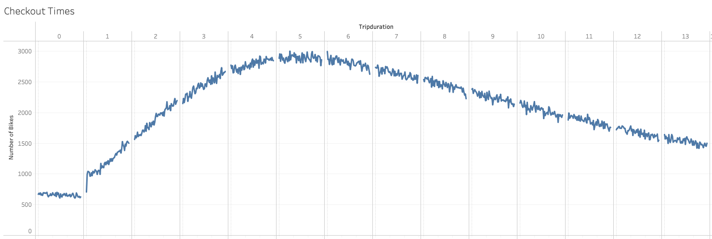
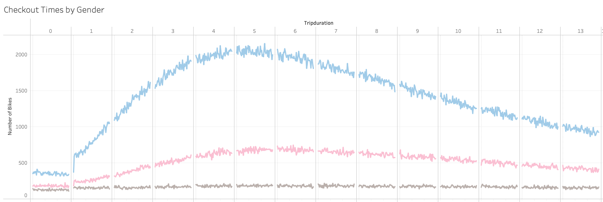

# Citi Bike Analysis

## Overview
Citi Bike is interested in expanding their NYC bike empire and has requested we perform analysis to see if their business model could be scaled down to work in a smaller market like Des Moines, Iowa. We analyzed rider demographics as well as how/where the bikes are being used to help make a recommendation to Citi Bike on expansion to a lower-volume market. 

## Interactive Tableau Dashboard
https://public.tableau.com/views/CitiBikeAnalysis_16621967660140/CitiBikeDataAnalysis

## Results
### Demographics
The vast majority of Citi Bike users are men.

### Trip Locations
The most popular start and end locations aligned with transportation hubs \[the ferry terminal and Penn Station\], major tourist destinations \[the Empire State Building and the World Trade Center\], and schools \[NYU and FIT\].

### Trip Duration
We found that the majority of trips lasted between 3–7 hours. 

Male customers tend to peak around 4–5 hours, while female customer usage peaks around 6 hours. 

This data indicates bikes will likely only be used by a maximum 1–2 customers per day, but for fairly long amounts of time, which may offer insight into how often bikes will need maintenance.

### Usage Time
Predictably, bike usage is heaviest on weekdays during the typical work commute times: 7–9am and 5–7pm. On weekends, bike usage remains fairly consistent throughout the day with a steady flow of riders from 9am to 7pm. 

 

Bike usage does not seem to vary based on gender. While the data does show volume bias towards male customers, female customer data shows the same usage patterns.

 

Subscribers are more likely to be active on weekdays, non-subscriber customers are more likely to be active on weekends.

 

## Summary
We found that while there is a significant amount of bike usage around tourist destinations, the userbase skews very heavily towards subscribers, which indicates repeat customers -- presumably local residents, as opposed to tourists using the bikes as a one-off ride. 

## Further Analysis
It may be worth tracking a randomly selected group of individual bike IDs to track things like distance ridden during each trip to see how far the average bike is traveling during a month. This can help predict maintenance costs for a fleet of bikes. 

We may also want to further analyze the demographics of riders to determine if certain age groups are more likely to utilize the bikes. Are there differences between the age groups by gender? This demographic analysis may help determine the best placement of bike hubs as well as help target marketing more effectively to groups most likely to be interested in becoming a subscriber. 